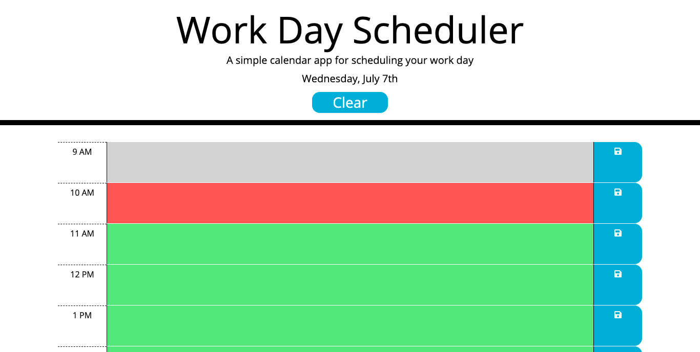

# Work-Day-Scheduler
<a href="https://tbetti.github.io/Work-Day-Scheduler/">Link to Website</a>

I added to a starter code to create a convenient work-day scheduler that allows users to input tasks for each hour of the work day.  Their tasks will be saved to local storage each time they hit one of the save icons to the right of each row.  The scheduler also keeps track of the current date and time of day.
